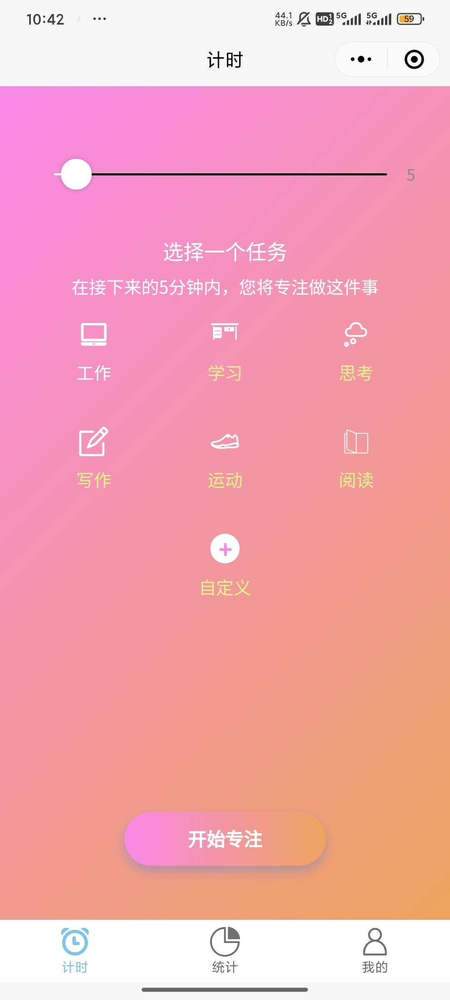
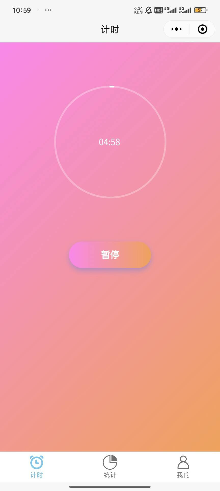
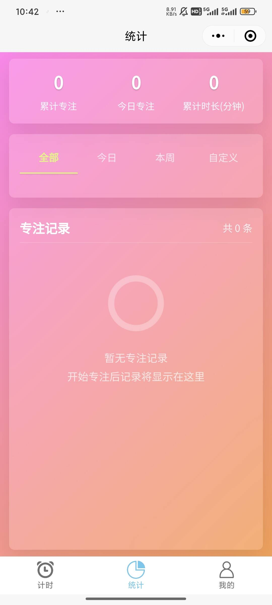
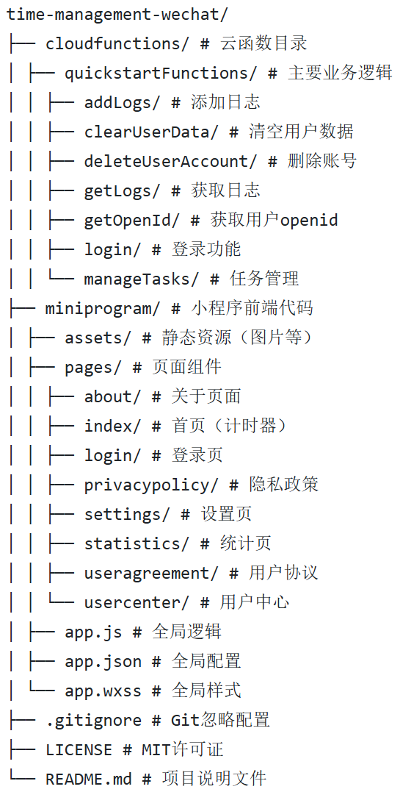

# 🍅 时间管理助手 - 微信小程序

[](https://github.com/BigGayJiuMo/time-management-wechat/blob/main/LICENSE)
[](https://github.com/BigGayJiuMo/time-management-wechat/stargazers)

> 基于番茄工作法的专注力提升工具 

时间管理助手是一款基于番茄工作法的专注力提升工具，帮助用户高效管理时间、提升工作效率。通过科学的计时方法、任务管理和数据统计，让时间管理变得简单有效。

<div align="center">
  
  
  
</div>

## ✨ 功能亮点

- 🍅 **番茄工作法计时器**：自定义专注时长（1-60分钟），可视化倒计时圆环
- 📊 **数据统计**：记录专注历史，生成时间分布图表
- 📝 **任务管理**：创建/删除任务分类，长按删除自定义任务
- 👤 **用户中心**：管理个人资料，查看用户协议与隐私政策
- ⚙️ **个性化设置**：屏幕常亮、振动提醒等偏好设置
- ☁️ **云端同步**：登录后数据多设备同步，保障数据安全
- 📱 **多设备支持**：手机、平板均可使用
- 🔔 **智能提醒**：专注结束振动提醒（可配置）

## 🛠️ 技术栈

### 前端
- 微信小程序原生框架
- WXML/WXSS/JavaScript
- Canvas 绘图实现倒计时圆环
- 微信开放能力（用户登录、云开发）

### 后端
- 微信云开发
- 云函数（Node.js）
- 云数据库（NoSQL）
- 云存储

### 主要云函数
| 云函数名称 | 功能描述 | 相关页面 |
|------------|----------|----------|
| `login` | 用户登录与注册 | 登录页 |
| `addLogs` | 保存专注记录 | 首页 |
| `getLogs` | 获取统计日志 | 统计页 |
| `manageTasks` | 任务管理（增删查） | 首页 |
| `deleteUserAccount` | 账号注销 | 设置页 |
| `clearUserData` | 数据清空 | 设置页 |

## 📂 项目结构
<div align="center">
  
</div>

## 🚀 安装与运行

### 准备工作
1. 安装 [微信开发者工具](https://developers.weixin.qq.com/miniprogram/dev/devtools/download.html)
2. 注册微信小程序账号

### 步骤
```bash
# 1. 克隆仓库
git clone https://github.com/yourusername/time-management-wechat.git

# 2. 导入项目
# 打开微信开发者工具 → 导入项目 → 选择项目目录
# 填写AppID（测试号可跳过）→ 勾选"云开发"

云环境配置
在微信开发者工具中打开"云开发"控制台
创建新环境（如 time-management-env）
修改 miniprogram/app.js 中的环境ID：

部署云函数
在开发者工具中右键点击 cloudfunctions 文件夹
选择"同步云函数列表"
逐个右键点击云函数 → 选择"上传并部署"

初始化数据库
在云开发控制台创建以下集合：

集合名称	描述	初始数据建议
users	用户信息	无需初始化
logs	专注记录	无需初始化
default_tasks	系统默认任务	导入默认任务数据(位于assets/data中)
user_tasks	用户自定义任务	无需初始化
user_cates	用户任务分类	无需初始化

📜 许可证
本项目采用 MIT 许可证 - 详情请查看许可证文件。
Copyright (c) 2025 [BigGayJiuMo]
